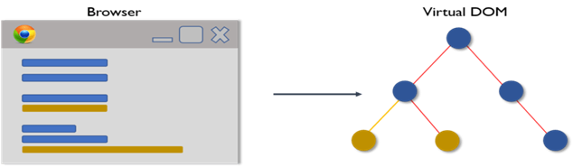

# React Interview Questions & Answers

   > Click :star: Please follow me on GitHub and LinkedIn [@RameshKumar](https://www.linkedin.com/in/ramesh-kumar-choudhary/) for more updates.


   ## React nterview Questions & Coding Project list available here :-

   >1. Click here for [React Interview Questions & Answers](https://github.com/rseetech/React-interview-questions) more information.
   >
   >2. Click here for [React Routing Axios Search Counter App Using MUI](https://github.com/rseetech/react-routing-axios-search-counter-app-using-mui) more information.
   >
   >3. Click here for [React Routing Pass data Child to Parent](https://github.com/rseetech/react-router-axios-pass-data-child-to-parent) more information.
   >
   >4. Click here for [React Create Tic Tac Toe Game](https://github.com/rseetech/react-create-tic-tac-toe-game) more information.

   
   ## JavaScript Coding Challenges and Interview Question list available here :-

   >1. Click here for [Javascript Basics Coding](https://github.com/rseetech/javascript-basics) more information.
   >  
   >2. Click here for [Javascript Coding Challenges](https://github.com/rseetech/javascript-coding-challenges) more information.
   >
   >3. Click here for [Javascript quick coding interview questions](https://github.com/rseetech/javascript-quick-coding-interview-questions) more information. 
   >
   >3. Click here for [Javascript interview asking output questions](https://github.com/rseetech/javascript-interview-asking-output-questions) more information. 


### Table of Contents

| No. | Questions                                                                              |
| --- | -------------------------------------------------------------------------------------------------------------------------------------------------------------------------------------------------------------- |
| 1   | [Introduction to React](#introduction-to-react)           |
| 2   | [What is React?](#what-is-react)                        |
| 3   | [Features of React](#features-of-react)                   |
| 4   | [What are the major features of React](#what-are-the-major-features-of-react)                   |
| 5   | [Advantages of ReactJS](#advantages-of-reactjs)                   |
| 6   | [Disadvantages of ReactJS ](#disadvantages-of-reactjs)                   |
| 7   | [What are Components in ReactJS? ](#what-are-components-in-reactjs)                   |
| 8   | [ReactJS-Lifecycle of Components ](#Rreactjs-lifecycle-of-components)                   |
| 9   | [Why we use JSX ](#why-we-use-jsx)                   |
| 10  | [Why can't browsers read JSX? ](#why-cant-browsers-read-jsx)                  |
| 11  | [What do you understand by Virtual DOM? ](#what-do-you-understand-by-virtual-dom)         |
| 12  | [How Virtual DOM works? ](#how-virtual-dom-works)             |
| 13  | [What is the difference between Real DOM and Virtual DOM? ](#what-is-the-difference-between-real-dom-and-virtual-dom)  |
| 14  | [What is the difference between Shadow DOM and Virtual DOM? ](#what-is-the-difference-between-shadow-dom-and-virtual-dom)    |
| 15  | [How different is Reacts ES6 syntax when compared to ES5? ](#how-different-is-reacts-es6-syntax-when-compared-to-es5)      |
| 16  | [What is the purpose of render() in React ](#what-is-the-purpose-of-render-in-react)         |
| 17  | [How can you embed two or more components into one? ](#how-can-you-embed-two-or-more-components-into-one) |
| 18  | [What is Props? ](#what-is-props)     |
| 19  | [What is state in React? ](#what-is-state-in-react)       |
| 20  | [What is the difference between state and props? ](#what-is-the-difference-between-state-and-props)|
| 21  | [Why should we not update the state directly? ](#why-should-we-not-update-the-state-directly)   |
| 22  | [What are synthetic events in React? ](#what-are-synthetic-events-in-react)            |
| 23  | [What is the use of refs? ](#what-is-the-use-of-refs)   |
| 24  | [What are Higher-Order Components? ](#what-are-higher-order-components)     |
| 25  | [What is context? ](#what-is-context)          |
| 26  | [How to write comments in React? ](#how-to-write-comments-in-react)       |
| 27  | [What are fragments? ](#what-are-fragments)       |
| 28  | [Why fragments are better than container divs? ](#why-fragments-are-better-than-container-divs) |
| 29  | [What is React Router? ](#what-is-react-router)                  |
| 30  | [What are the components of React Router v4? ](#what-are-the-router-components-of-react-router-v4)   |
| 31  | [How to implement default or NotFound page? ](#how-to-implement-default-or-notfound-page)                  |
| 32  | [How to perform automatic redirect after login? ](#how-to-perform-automatic-redirect-after-login)                  |
| 33  | [What Are React Hooks? ](#what-are-react-hooks)                  |
| 34  | [What are the benefits of using React Hooks? ](#what-are-the-benefits-of-using-react-hooks)                  |
| 35  | [React Hook Types ](#react-hook-types)                   |
| 36  | [Working example of useReducer hook. ](#working-example-of-usereducer-hook.)                   |
| 37  | [How is useMemo different from useCallback? ](#how-is-usememo-different-from-usecallback)                  |
| 38  | [Use Custom Hooks For Sharing Application Logic ](#use-custom-hooks-for-sharing-application-logic)                   |
| 39  | [What Is React Redux and How Do You Use it? ](#what-is-react-redux-and-how-do-you-use-it)                  |
| 40  | [Why Use Redux? ](#why-use-redux)                  |
| 41  | [Show how the data flows through Redux? ](#show-how-the-data-flows-through-redux)       |
| 42  | [List down the components of Redux. ](#list-down-the-components-of-redux.)        |
| 43  | [Redux-Saga ](#redux-saga)                   |
| 44  | [What are the differences between call() and put() in redux-saga? ](#what-are-the-differences-between-call()-and-put()-in-redux-saga)      |
| 45  | [How do you handle data persistence in a React application? ](#how-do-you-handle-data-persistence-in-a-react-application?)|
| 46  | [react-error-boundary ](#react-error-boundary)       |
| 47  | [Why you should use Error Boundaries in React ](#why-you-should-use-error-boundaries-in-react)   |
| 48  | [How do you handle performance optimization in a React application? ](#how-do-you-handle-performance-optimization-in-a-react-application)       |
| 49  | [How do you handle data validation in a React application? ](#how-do-you-handle-data-validation-in-a-react-application) |
| 50  | [How do you handle security in a React application? ](#how-do-you-handle-security-in-a-react-application?)|
| 51  | [What is a promise ](#what-is-a-promise)      |
| 52  | [Why do you need a promise ](#why-do-you-need-a-promise)     |
| 53  | [What are the three states of promise ](#what-are-the-three-states-of-promise)       |
| 54  | [What is promise all ](#what-is-promise-all)     |

                              

1. ### Introduction to React

   React is an efficient, flexible, and open-source JavaScript framework library that allows developers to the creation of simple, fast, and scalable web applications. Jordan Walke, a software engineer who was working for Facebook created React. It was first deployed on the news feed of Facebook in 2011 and on Instagram in 2012. Developers from the Javascript background can easily develop web applications with the help of React.

   **[⬆ Back to Top](#table-of-contents)**

2. ### What is React?

   ReactJS is an open-source front-end JavaScript library for building user interfaces. ReactJS is maintained by Facebook and a community of individual developers and companies. It is widely used as a base in building single-page websites and mobile applications. It is very easy to use, and it allows users to create reusable UI components.

   **[⬆ Back to Top](#table-of-contents)**

3. ### Features of React

   1. **JSX :** JSX is an extension to javascript. Though it is not mandatory to use JSX in react, it is one of the good features and easy to use.

   2. **Components:** Components are like pure javascript functions that help make the code easy by splitting the logic into reusable independent code. We can use components as functions and components as classes. Components also have a state, props which makes life easy. Inside a class, the state of each of the props is maintained.
   
   3. **Virtual DOM:** React creates a virtual dom, i.e., in-memory data -structure cache. Only the final changes of DOM has later updated in the browsers DOM.

   4. **Javascript Expressions:** JS expressions can be used in the jsx files using curly brackets, for example {}.

   **[⬆ Back to Top](#table-of-contents)**

4. ### What are the major features of React?
   The major features of React are:
   1.	It uses VirtualDOM instead of RealDOM considering that RealDOM manipulations are expensive.
   2.	Supports server-side rendering. / server-side rendering (SSR)
   3.	Follows Unidirectional data flow or data binding.
   4.	Uses reusable/composable UI components to develop the view.

**[⬆ Back to Top](#table-of-contents)**

5. ### Advantages of ReactJS
   Here, are important pros/benefits of using ReactJS:

   1.	ReactJS uses virtual dom that makes use of in-memory data-structure cache, and only the final changes are updated in browsers dom. This makes the app faster.
   2.	You can create components of your choice by using the react component feature. The components can be reused and also helpful in code maintenance.
   3.	Reactjs is an open-source javascript library, so it is easy to start with.
   4.	ReactJS has become very popular in a short span and maintained by Facebook and Instagram. It is used by many famous companies like Apple, Netflix, etc.
   5.	Facebook maintains ReactJS, the library, so it is well maintained and kept updated.
   6.	ReactJS can be used to develop rich UI for both desktop and mobile apps.
   7.	Easy to debug and test as most of the coding is done in Javascript rather than on Html.
   8.	Easy to Learn and USe. ReactJS is much easier to learn and use. ...
   9.	Creating Dynamic Web Applications Becomes Easier. ...
   10. Reusable Components. ...
   11. Performance Enhancement. ...
   12. The Support of Handy Tools. ...
   13. Known to be SEO Friendly. ...
   14. The Benefit of Having JavaScript Library. ...
   15. Scope for Testing the Codes.


**[⬆ Back to Top](#table-of-contents)**

6. ### Disadvantages of ReactJS
   Here, are cons/ drawbacks of using ReactJS:
   1.	Most of the code is written in JSX, i.e., Html and css are part of javascript, it can be quite confusing as most other frameworks prefer keeping Html separate from the javascript code.
   2.	The file size of ReactJS is large.
   3.	The high pace of development. 
   4.	Poor Documentation.
   5.	View Part. 
   6.	JSX as a barrier.

**[⬆ Back to Top](#table-of-contents)**

7. ### What are Components in ReactJS?
   Components are like pure javascript functions that help make the code easy by splitting the logic into reusable independent code.

   **Functions Components**
   Functional components are some of the more common components that will come across while working in React. These are simply JavaScript functions. We can create a functional component to React by writing a JavaScript function. These functions may or may not receive data as parameters. In the functional Components, the return value is the JSX code to render to the DOM tree.
   ```
   test.jsx

   import React from 'react';
   import ReactDOM from 'react-dom';
   function Hello() {
      return <h1>Hello, From RseeTech!</h1>;
   } 
   const Hello_comp = <Hello />;
   export default Hello_comp;
   ```
   ```
   index.js

   import React from 'react';
   import ReactDOM from 'react-dom';
   import Hello_comp from './test.jsx';

   ReactDOM.render(
      Hello_comp,
      document.getElementById('root')
   );
   ```
   **Class  Component**
   React class based components are the bread and butter of most modern web apps built in ReactJS. These components are simple classes (made up of multiple functions that add functionality to the application). All class based components are child classes for the Component class of ReactJS. 
   Here is a ReactJS example that uses a class as a component.
   ```
   test.jsx

   import React from 'react';
   import ReactDOM from 'react-dom';

   class Hello extends React. Component {
      render() {
         return <h1>Hello, From RseeTech!</h1>;
      }
   }
   export default Hello;
   ```
   We can use Hello component in index.js file as follows:
   ```
   index.js

   import React from 'react';
   import ReactDOM from 'react-dom';
   import Hello from './test.jsx';

   ReactDOM.render(
      <Hello />, document.getElementById('root')
   );
   ```

   **[⬆ Back to Top](#table-of-contents)**

8. ### ReactJS Lifecycle of Components
   Every React Component has a lifecycle of its own, lifecycle of a component can be defined as the series of methods that are invoked in different stages of the component’s existence.

   1.	**Initialization:** This is the stage where the component is constructed with the given Props and default state. This is done in the constructor of a Component Class.

   2.	**Mounting:** Mounting is the stage of rendering the JSX returned by the render method itself.

   3.	**Updating:** Updating is the stage when the state of a component is updated and the application is repainted.

   4.	**Unmounting:** As the name suggests Unmounting is the final step of the component lifecycle where the component is removed from the page.


   


   1. **Initialization:** In this phase, the developer has to define the props and initial state of the component this is generally done in the constructor of the component. 

      ```
      class Clock extends React.Component {
         constructor(props)
         {
            // Calling the constructor of
            // Parent Class React.Component
            super(props);
            
            // Setting the initial state
            this.state = { date : new Date() };
         }
      }
      ```

   2. **Mounting:** Mounting is the phase of the component lifecycle when the initialization of the component is completed and the component is mounted on the DOM and rendered for the first time on the webpage.

      1.	**componentWillMount() Function:** As the name clearly suggests, this function is invoked right before the component is mounted on the DOM i.e. this function gets invoked once before the render() function is executed for the first time.

      2.	**componentDidMount() Function:** Similarly as the previous one this function is invoked right after the component is mounted on the DOM i.e. this function gets invoked once after the render() function is executed for the first time

   3. **Updation:** React is a JS library that helps create Active web pages easily. Now active web pages are specific pages that behave according to their user.
   componentWillRecieveProps() Function: This is a Props exclusive Function and is independent of States. This function is invoked before a mounted component gets its props reassigned. The function is passed the new set of Props which may or may not be identical to the original Props.

      ```
      componentWillRecieveProps(newProps)

      {
         if (this.props !== newProps) {
            console.log(" New Props have been assigned ");
            // Use this.setState() to rerender the page.
         }
      }
      ```

      1.	**setState() Function:** This is not particularly a Lifecycle function and can be invoked explicitly at any instant. This function is used to update the state of a component. You may refer to this article for detailed information.

      2.	**shouldComponentUpdate() Function:** By default, every state or props update re-render the page but this may not always be the desired outcome, sometimes it is desired that updating the page will not be repainted. The shouldComponentUpdate() Function fulfills the requirement by letting React know whether the component’s output will be affected by the update or not.

      3.	**componentWillUpdate() Function:** As the name clearly suggests, this function is invoked before the component is rerendered i.e. this function gets invoked once before the render() function is executed after the updation of State or Props.

      4.	**componentDidUpdate() Function:** Similarly this function is invoked after the component is rerendered i.e. this function gets invoked once after the render() function is executed after the updation of State or Props.

   4. **Unmounting:** This is the final phase of the lifecycle of the component that is the phase of unmounting the component from the DOM. 
   The following function is the sole member of this phase.
      1.	**componentWillUnmount() Function:** This function is invoked before the component is finally unmounted from the DOM i.e. this function gets invoked once before the component is removed from the page and this denotes the end of the lifecycle.  

      ```
      import React from 'react';
      import ReactDOM from 'react-dom';

      class Test extends React.Component {
         constructor(props)
         {
            super(props);
            this.state = { hello : "World!" };
         }

         componentWillMount()
         {
            console.log("componentWillMount()");
         }

         componentDidMount()
         {
            console.log("componentDidMount()");
         }

         changeState()
         {
            this.setState({ hello : "Ramesh!" });
         }

         render()
         {
            return (
               <div>
                  <h1>Hello{ this.state.hello }</h1>
                  <h2>
                     <a onClick={this.changeState.bind(this)}>Press Here!</a>
                  </h2>
               </div>);
         }

         shouldComponentUpdate(nextProps, nextState)
         {
            console.log("shouldComponentUpdate()");
            return true;
         }

         componentWillUpdate()
         {
            console.log("componentWillUpdate()");
         }

         componentDidUpdate()
         {
            console.log("componentDidUpdate()");
         }
      }

      ReactDOM.render(<Test />, document.getElementById('root'));
      ```

   **[⬆ Back to Top](#table-of-contents)**


9. ### Why we use JSX?


   It is faster than regular JavaScript because it performs optimization while translating the code to JavaScript.

   Instead of separating technologies by putting markup and logic in separate files, React uses components that contain both. t is type-safe, and most of the errors can be found at compilation time.
   It makes easier to create templates.


   **[⬆ Back to Top](#table-of-contents)**

10. ### Why cant browsers read JSX?

      Browsers cannot read JSX directly because they can only understand JavaScript objects, and JSX is not a regular JavaScript object. Thus, we need to transform the JSX file into a JavaScript object using transpilers like Babel and then pass it to the browser.

   **[⬆ Back to Top](#table-of-contents)**

11. ### What do you understand by Virtual DOM?

   A virtual DOM is a lightweight JavaScript object which originally is just a copy of the real DOM. It is a node tree that lists the elements, their attributes and content as Objects and their properties. React’s render function creates a node tree out of the React components. It then updates this tree in response to the mutations in the data model which is caused by various actions done by the user or by the system.

   **[⬆ Back to Top](#table-of-contents)**

12. ### How Virtual DOM works?

   The Virtual DOM works in three simple steps.

   i.	Whenever any underlying data changes, the entire UI is re-rendered in Virtual DOM representation.

   

   ii.	Then the difference between the previous DOM representation and the new one is calculated.

   

   iii.	Once the calculations are done, the real DOM will be updated with only the things that have actually changed.

   

   **[⬆ Back to Top](#table-of-contents)**

   
13. ### What is the difference between Real DOM and Virtual DOM?
   Below are the main differences between Real DOM and Virtual DOM,

   | Real DOM                                     | Virtual DOM                                     |
   | -------------------------------------------- | ----------------------------------------------- |
   | Updates are slow                             | Updates are fast                                |
   | DOM manipulation is very expensive.          | DOM manipulation is very easy                   |
   | You can update HTML directly.                | You Can’t directly update HTML                  |
   | It causes too much of memory wastage         | There is no memory wastage                      |
   | Creates a new DOM if element updates         | It updates the JSX if element update            |


   **[⬆ Back to Top](#table-of-contents)**


14. ### What is the difference between Shadow DOM and Virtual DOM?

   The Shadow DOM is a browser technology designed primarily for scoping variables and CSS in web components. The Virtual DOM is a concept implemented by libraries in JavaScript on top of browser APIs.

   **[⬆ Back to Top](#table-of-contents)**

15. ### How different is Reacts ES6 syntax when compared to ES5?

   Syntax has changed from ES5 to ES6 in the following aspects:


   **require vs import**
   ```
   // ES5
   var React = require('react');
   // ES6
   import React from 'react';
   ```
   **export vs exports**
   ```
   // ES5
   module.exports = Component;
   // ES6
   export default Component;
   ```

   **[⬆ Back to Top](#table-of-contents)**

16. ### What is the purpose of render in React.

   Each React component must have a render() mandatorily. It returns a single React element which is the representation of the native DOM component. If more than one HTML element needs to be rendered, then they must be grouped together inside one enclosing tag such as `<form>`, `<group>`,`<div>` etc. This function must be kept pure i.e., it must return the same result each time it is invoked.

   **[⬆ Back to Top](#table-of-contents)**

17. ### How can you embed two or more components into one?
   We can embed components into one in the following way:

      class MyComponent extends React.Component {
         render(){
            return(              
                  <div>          
                     <h3>Hello</h3>
                     <Header/>
                  </div>
            );
         }
      }
      
      class Header extends React.Component {
         render(){
            return
               <h3>Header Component</h3>
            };
      }
      ReactDOM.render(
         <MyComponent/>, document.getElementById('content')
      );

   **[⬆ Back to Top](#table-of-contents)**

18. ### What is Props?

   Props is the shorthand for Properties in React. They are read-only components which must be kept pure 
   i.e. immutable. They are always passed down from the parent to the child components throughout the application. A child component can never send a prop back to the parent component. This help in maintaining the unidirectional data flow and are generally used to render the dynamically generated data.

   **[⬆ Back to Top](#table-of-contents)**

19. ### What is state in React?

   State of a component is an object that holds some information that may change over the lifetime of the component. We should always try to make our state as simple as possible and minimize the number of stateful components.

      class User extends React.Component {
         constructor(props) {
            super(props)
            this.state = {
               message: 'Welcome to React world'
            }
         }

         render() {
            return (
               <div>
               <h1>{this.state.message}</h1>
               </div>
            )
         }
      }

   

   **[⬆ Back to Top](#table-of-contents)**

20. ### What is the difference between state and props?

   Both props and state are plain JavaScript objects. While both of them hold information that influences the output of render, they are different in their functionality with respect to component. Props get passed to the component similar to function parameters whereas state is managed within the component similar to variables declared within a function.

   **[⬆ Back to Top](#table-of-contents)**

21. ### Why should we not update the state directly?
   If you try to update state directly then it won't re-render the component.

   **Wrong**
   >  
   >   this.state.message = 'Hello world'
   >

   Instead use setState() method. 
   It schedules an update to a component's state object. When state changes, the component responds by re-rendering.

   **Correct**
   >
   >   this.setState({ message: 'Hello World' })
   >   

   **[⬆ Back to Top](#table-of-contents)**

22. ### What are synthetic events in React?
   SyntheticEvent is a cross-browser wrapper around the browser's native event. It's API is same as the browser's native event, including **stopPropagation()** and **preventDefault()**, except the events work identically across all browsers.

   **[⬆ Back to Top](#table-of-contents)**

23. ### What is the use of refs?
   The ref is used to return a reference to the element. They should be avoided in most cases, however, they can be useful when you need a direct access to the DOM element or an instance of a component.
      
   
      class MyComponent extends React.Component {
         constructor(props) {
            super(props)
            this.myRef = React.createRef()
         }
         render() {
            return <div ref={this.myRef} />
         }
      }

   **[⬆ Back to Top](#table-of-contents)**

24. ### What are Higher-Order Components?

   A higher-order component ***(HOC)*** is a function that takes a component and returns a new component. Basically, it's a pattern that is derived from React's compositional nature.

   We call them pure components because they can accept any dynamically provided child component but they won't modify or copy any behavior from their input components.
   
   >  const EnhancedComponent = higherOrderComponent(WrappedComponent)

   HOC can be used for many use cases:

   1.	Code reuse, logic and bootstrap abstraction.
   2. Render hijacking.
   3. State abstraction and manipulation.
   4. Props manipulation.

   **[⬆ Back to Top](#table-of-contents)**

25. ### What is context?
   Context provides a way to pass data through the component tree without having to pass props down manually at every level.
   For example, authenticated user, locale preference, UI theme need to be accessed in the application by many components.

   >   const {Provider, Consumer} = React.createContext(defaultValue)


   **[⬆ Back to Top](#table-of-contents)**

26. ### How to write comments in React?
   The comments in React/JSX are similar to JavaScript Multiline comments but are wrapped in curly braces.

   **Single-line comments:**
      <div>
      {/* Single-line comments(In vanilla JavaScript, the single-line comments are represented by double slash(//)) */}
      {`Welcome ${user}, let's play React`}
      </div>

   **Multi-line comments:**
      <div>
      {/* Multi-line comments for more than
         one line */}
      {`Welcome ${user}, let's play React`}
      </div>

   **[⬆ Back to Top](#table-of-contents)**

27. ### What are fragments?
   It's common pattern in React which is used for a component to return multiple elements. Fragments let you group a list of children without adding extra nodes to the DOM.

      render() {
         return (
            <React.Fragment>
               <ChildA />
               <ChildB />
               <ChildC />
            </React.Fragment>
         )
      }

      There is also a shorter syntax, but it's not supported in many tools:

      render() {
         return (
            <>
               <ChildA />
               <ChildB />
               <ChildC />
            </>
         )
      }
   

   **[⬆ Back to Top](#table-of-contents)**

28. ### Why fragments are better than container divs?

   Below are the list of reasons,

   1.	Fragments are a bit faster and use less memory by not creating an extra DOM node. This only has a real benefit on very large and deep trees.

   2.	Some CSS mechanisms like Flexbox and CSS Grid have a special parent-child relationships, and adding divs in the middle makes it hard to keep the desired layout.

   3.	The DOM Inspector is less cluttered.

   **[⬆ Back to Top](#table-of-contents)**

29. ### What is React Router?

   React Router is a powerful routing library built on top of React that helps you add new screens and flows to your application incredibly quickly, all while keeping the URL in sync with what's being displayed on the page.

   **[⬆ Back to Top](#table-of-contents)**

30. ### What are the Router components of React Router v4?

   React Router v4 provides below 3 <Router> components:

   1.	 `<BrowserRouter>`
   2.	 `<HashRouter>`
   3.	`<MemoryRouter>`

   **[⬆ Back to Top](#table-of-contents)**

31. ### How to implement default or NotFound page?

   A `<Switch>` renders the first child `<Route>` that matches. A `<Route>` with no path always matches. So you just need to simply drop path attribute as below

   ```
      <Switch>
         <Route exact path="/" component={Home}/>
         <Route path="/user" component={User}/>
         <Route component={NotFound} />
      </Switch>
   ```

   **[⬆ Back to Top](#table-of-contents)**

32. ### How to perform automatic redirect after login?

      The react-router package provides `<Redirect>` component in React Router. Rendering a `<Redirect>` will navigate to a new location. Like server-side redirects, the new location will override the current location in the history stack.

      ```
         import React, { Component } from 'react'
         import { Redirect } from 'react-router'

         export default class LoginComponent extends Component {
            render() {
               if (this.state.isLoggedIn === true) {
                  return <Redirect to="/your/redirect/page" />
               } else {
                  return <div>{'Login Please'}</div>
               }
            }
         }
      ```

   **[⬆ Back to Top](#table-of-contents)**

33. ### What Are React Hooks?

   React Hooks are a feature in React that allows developers to use state and other React features without writing a class component. Hooks are functions that let developers "hook into" the React state and lifecycle methods from a functional component.

   **[⬆ Back to Top](#table-of-contents)**

34. ### What are the benefits of using React Hooks?

   Some benefits of using React Hooks are:

   1. It allows for simpler and cleaner code.

   2. Hooks make it easier to reuse stateful logic between components.

   3. It allows developers to use state and other React features without writing a class component, which simplifies the component's structure.

   4. It makes testing components easier because it is easier to test a function than a class.

   5. It simplifies the management of component state and side effects.

   **[⬆ Back to Top](#table-of-contents)**

35. ### React Hook Types

   #### List of Hooks below:

   1.	**useState Hook:**
      useState to Create State Variables
      Update State Variables
   2.	**useReducer Hook:**
      useReducer is (Another) Powerful State Management Tool
      Reducers are simple, predictable (pure) functions that take a previous state object and an action object and return a new state object.
   3.	**useEffect Hook:**
      useEffect to Perform Side Effects
      Side effects are when we need to reach into the outside world. Such as fetching data from an API or working with the DOM.
   4.	**useRef Hook:**
      useRef to Reference React Elements
   5.	**useCallback Hook:**
   useCallback Prevents Callbacks from Being Recreated
   Callback functions are the name of functions that are "called back" within a parent component.
   6.	**useMemo Hook:**
   useMemo Can Improve Expensive Operations
   useMemo allows us to memoize, or remember the result of expensive operations when they have already been made for certain inputs.
   7.	**useContext Hook:**
   useContext Helps Us Avoid Prop Drilling
   In some cases, it is fine to pass props through multiple components, but it is redundant to pass props through components which do not need it.


   **[⬆ Back to Top](#table-of-contents)**

36. ### Working example of useReducer hook.

   ```
      function reducer(state, dispatch) {
         switch(action.type) {
            case 'increment':
                  return state+1;
            case 'decrement':
                  return state-1;
            default:
                  throw new Error();
         }
      }

      function useReducer() {
         // state is the state we want to show in the UI.
         const [state, dispatch] = React.useReducer(reducer, 0);

         return (
            <>
            Count : {state}
            <button onClick={() => dispatch({type:'decrement'})}>-</button>
            <button onClick={() => dispatch({type:'increment'})}>+</button>
            </>
         )
      }

   ```
   
   **[⬆ Back to Top](#table-of-contents)**

37. ### How is useMemo different from useCallback?

   The main difference between useMemo and useCallback hook is, useMemo returns memoized value and useCallback returns memoised function.

   #### Understanding useMemo

   ```
      import { React, useState, useMemo } from 'react';
      import ChildComponent from './ChildComponent'

      function App() {
         const [num, setNum] = useState(0);
         const getChildComp = useMemo(() => <ChildComponent />, []);
         return(
            <div>
               <h1>{num}</h1>
               {getChildComp}
               <button onClick={() => setNum(num + 1)}> Addition </button>
            </div>
         );
         }

   ```

   #### Understanding useCallback

   ```

      import { React, useState } from 'react';
      import ChildComponent from './ChildComponent'

      function App() {
      const [num, setNum] = useState(0);

      const handleUpdateNum = () => {
         //some code
      };

      const getChildComp = useMemo(
         () => <ChildComponent handleUpdateNum={handleUpdateNum} />,
         [handleUpdateNum]
      );

      return(
         <div>
            <h1>{num}</h1>
            {getChildComp}
            <button onClick={() => setNum(num + 1)}> Addition </button>
         </div>
      );
      }

   ```

   **[⬆ Back to Top](#table-of-contents)**

38. ### Use Custom Hooks For Sharing Application Logic
   You can extract your component’s logic into reusable functions as custom hooks with the release of React Hooks. You will find that some of the application logic will be used on several components repeatedly.
      
   **[⬆ Back to Top](#table-of-contents)**

39. ### What Is React Redux and How Do You Use it?

   A predictable state container for JavaScript applications and Redux is an open-source JavaScript library used to manage application state.

   Redux is simply a store to store the state of the variables in your app. Redux creates a process and procedures to interact with the store so that components will not just update or read the store randomly. Similar to the bank. It does not mean because you have money in the bank that you can go anytime, open the vault, and take money. You have to go through certain steps to withdrawal money.

   **[⬆ Back to Top](#table-of-contents)**

40. ### Why Use Redux?

   #### For making data consist.

   Well, an application has its state, which can be a combination of the states of its internal components.

   Let's take an e-commerce website for example. An e-commerce website will have several components like the cart component, user profile component, previously viewed section component, and so on.

   We'll take the cart component which displays the number of items in a user's cart. The state of the cart component will `consist` of all the items the user has added to the cart and the total number of those items. At all times the application is up and running, this component has to show the updated number of items in the user's cart.

   **[⬆ Back to Top](#table-of-contents)**

41. ### What are the core principles of Redux?

   Redux follows three fundamental principles:

   i.Single source of truth: The state of your whole application is stored in an object tree within a single store. The single state tree makes it easier to keep track of changes over time and debug or inspect the application.

   ii.State is read-only: The only way to change the state is to emit an action, an object describing what happened. This ensures that neither the views nor the network callbacks will ever write directly to the state.

   iii.Changes are made with pure functions: To specify how the state tree is transformed by actions, you write reducers. Reducers are just pure functions that take the previous state and an action as parameters, and return the next state.

   **[⬆ Back to Top](#table-of-contents)**

41. ### Show how the data flows through Redux?

   


   **[⬆ Back to Top](#table-of-contents)**

42. ### List down the components of Redux.

   Redux is composed of the following components:

   i.	**Action** – It’s an object that describes what happened.

   ii. **Reducer** –  It is a place to determine how the state will change.

   iii. **Store** – State/ Object tree of the entire application is saved in the Store.

   iv. **View** – Simply displays the data provided by the Store.


   


   **[⬆ Back to Top](#table-of-contents)**

43. ### Redux-Saga

   An intuitive Redux side effect manager.

   Easy to manage, easy to test, and executes efficiently.

   **[⬆ Back to Top](#table-of-contents)**

44. ### What are the differences between call() and put() in redux-saga?

   Both `call()` and `put()` are effect creator functions. call() function is used to create effect description, which instructs middleware to call the promise. put() function creates an effect, which instructs middleware to dispatch an action to the store.
   
   **call():** is a blocking effect, which means that the saga will wait for promise resolving before moving on to the next step.
   
   **put() :** on the other hand, is a non-blocking effect, which means that the saga can continue to the next step and action will be dispatched within internal scheduler.

   ### Generators

   Regular functions return only one, single value (or nothing).

   Generators can return `(“yield”)` multiple values, one after another, on-demand. They work great with iterables, allowing to create data streams with ease.

   #### Generator functions

   To create a generator, we need a special syntax construct: function*, so-called “generator function”.

   ### yield

   The yield operator is used to pause and resume a generator function.
   
   ```
      function* mySaga() {
         // Dispatch an action to the store using put()
         yield put({ type: "MY_ACTION" });

         // Call a function and wait for the result using call()
         const result = yield call(myFunction, "some argument");
         // Dispatch another action to the store using put()
         yield put({ type: "ANOTHER_ACTION", payload: result });
      }

   ```

   **[⬆ Back to Top](#table-of-contents)**

45. ### How do you handle data persistence in a React application?

   In a React application, data persistence can be handled using a variety of methods, including:

   1.	**Local storage:** This allows you to store key-value pairs in the browser’s local storage, which can be retrieved even after the user closes the browser or restarts their device.

   2.	**Cookies:** Cookies are small pieces of data that are stored in the user’s browser and can be accessed by the website on subsequent visits.

   3.	**IndexedDB:** It’s a low-level API for client-side storage of large amounts of structured data, including files/blobs.

   4.	**Web SQL Database:** This is a deprecated technology for storing data in a client-side database using SQL.

   5.	**Server-side storage:** You can also store data on a remote server using an API or a database such as MySQL, MongoDB, etc.

   6.	**Redux or Mobx:** State management libraries like Redux or Mobx can be used to manage and persist application state across different components and sessions.


   **[⬆ Back to Top](#table-of-contents)**

47. ### Difference Between Local Storage, Session Storage, And Cookies

| Local Storage                                     | Session Storage                           |  Cookies 
    |
   | ------------------------------ | ------------------------------- |---------------------------|
   | The storage capacity of local storage is 5MB/10MB | The storage capacity of session storage is 5MB  | The storage capacity of Cookies is 4KB |
   | As it is not session-based, it must be deleted via javascript or manually| It’s session-based and works per window or tab. This means that data is stored only for the duration of a session, i.e., until the browser (or tab) is closed  | Cookies expire based on the setting and working per tab and window  |
   | The client  can only read local storage| The client can only read local storage  | Both clients and servers can read and write the cookies |
   | There is no transfer of data to the server| There is no transfer of data to the server  | Data transfer to the server is exist |
   | There are fewer old browsers that support it| There are fewer old browsers that support it  | It is supported by all the browser including older browser |

   **[⬆ Back to Top](#table-of-contents)**

46. ### react-error-boundary

   Simple reusable React error boundary component

   **[⬆ Back to Top](#table-of-contents)**

47. ### Why you should use Error Boundaries in React

   React Error Boundaries were introduced in React version 16 to generate a fallback UI in case a component were to crash. This was to ensure that a JavaScript error in a single component should not crash the whole app.

   >  npm i react-error-boundary@3.0.2

      ```
         class ErrorBoundary extends React.Component {
            state = {error: null};
            render() {
               if (!this.state.error) return this.props.children;
               else return <h1>Error!</h1>;
            }
            static getDerivedStateFromError(error) {
               return {error};
            }
         }
         
         export const () => (
            <App>
               <ErrorBoundary>
                     <Header>
                     <ErrorBoundary>
                        <Router />
                     </ErrorBoundary>
                     <Footer />
               </ErrorBoundary>
            </App>
         );

      ```
   **[⬆ Back to Top](#table-of-contents)**

48. ### How do you handle performance optimization in a React application?

   List of optimization:

   1. Using the React.memo method for functional components

   2. Using React’s Context API instead of props drilling.

   3. Using the useEffect hook to handle side effects in functional components.

   4. Using the useCallback and useMemo hooks to prevent unnecessary re-renders and improve performance.

   5. Lazy loading of components and code splitting.

   6. Minimizing the number of DOM updates by using the key prop when rendering a list of items.

   7. Using the useReducer hook to manage state updates instead of useState

   8. Using a virtualized list library like react-virtualized, react-window etc.

   9. It’s always a good idea to test performance with real-world use cases and user interactions before and after making any optimization.

   10. **Lazy loading:** Lazy loading is a technique where you only load the components that are needed for the current view. This can greatly improve the performance of your application.

   11. **Code splitting:** Code splitting is a technique where you split your application into smaller chunks of code that are loaded on demand. This can greatly improve the performance of your application.

   12. Optimize the loading time of your application by using techniques like code minification, compression, and caching.

   13. Code splitting:
   14. Lazy loading
   15. Use of a bundler such as Webpack
   16. Use of caching
   17. Use of efficient algorithms and data structures
   18. Regular performance monitoring and profiling
   19. Use of optimization techniques such as memorization

   **[⬆ Back to Top](#table-of-contents)**

49. ### How do you handle data validation in a React application?

   Data validation in a React application can be handled in a variety of ways, including:

   1.	**PropTypes:** React provides a built-in library called PropTypes that allows you to specify the expected data types for your component’s props. PropTypes will validate the props passed to your component at runtime, and will log warnings in the browser console if any props are of the wrong type.

   2.	**Custom validation functions:** You can write custom validation functions to check the validity of your data. These functions can be called inside your component, and can be used to set error messages or update the state to indicate invalid data.

   3.	**Third-party libraries:** There are several third-party libraries available for data validation in React, such as yup, joi, or zod. These libraries provide a more powerful and flexible way to validate data, and often provide a more user-friendly way to report errors.

   **[⬆ Back to Top](#table-of-contents)**

50. ### How do you handle security in a React application?

   Handling security in a React application involves multiple steps, including:
   
   1. **Input validation:** Validate all user inputs on the client and server side to prevent any malicious data from being processed.

   2. **Authenticating and authorizing users:** Use a secure authentication mechanism such as JSON Web Tokens (JWT) to ensure that only authorized users can access sensitive data.

   3. **Storing sensitive data securely:** Do not store sensitive information such as passwords and credit card numbers in local storage, use encrypted storage instead.

   4. **Implementing HTTPS:** Use HTTPS to ensure secure communication between the client and server and protect against network attacks such as man-in-the-middle attacks.

   5. Keeping dependencies up-to-date:** Regularly update React and its dependencies to patch any known security vulnerabilities.

   6. **Using Content Security Policy (CSP):** Implement a Content Security Policy (CSP) to restrict the types of resources that can be loaded in a React application and prevent cross-site scripting (XSS) attacks.

   7. **Regular security audits:** Conduct regular security audits to identify and address potential security issues in a timely manner.

   **[⬆ Back to Top](#table-of-contents)**

51. ### What Is Server Side Rendering?

   Server Side Rendering (SSR) is used to render web pages on the server before sending them to the client. This allows for faster page loads, improved performance, and an SEO-friendly rendering solution for React applications. In addition, SSR can provide a better experience for users with slower internet connections or devices with limited memory and processing power by performing the initial rendering of components on the server.

   **[⬆ Back to Top](#table-of-contents)**

52. ### Why is React Js called as Single Page Application

   A single-page application is a web application that dynamically updates and renders content on a single HTML page, improving user experience by reducing page reloads. Instead of loading entire new pages from the server, SPAs request data and markup fragments to update the content, resulting in smoother transitions and faster load times.
   
   A Single Page Application is a web application or website that interacts with the web browser by dynamically rewriting the current web page with new data from the web server, instead of the default method of the browser loading entire new pages.

   This means that the URL of your website will not change completely (page will not reload), instead it will keep getting content and rewriting the DOM with it instead of loading a new page.

   **[⬆ Back to Top](#table-of-contents)**
